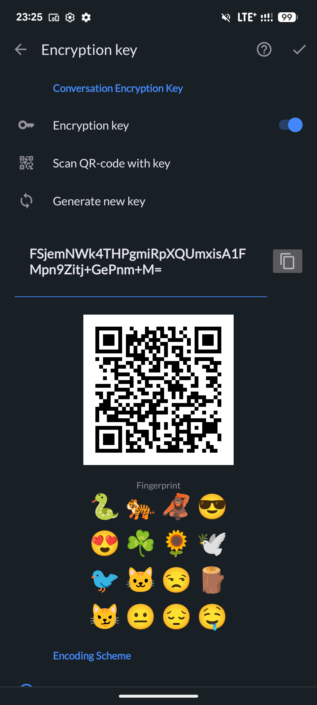
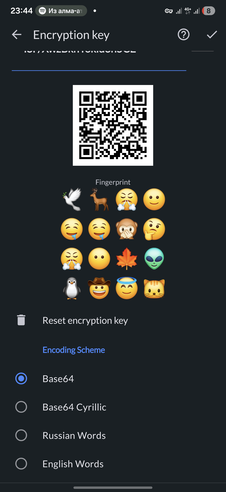
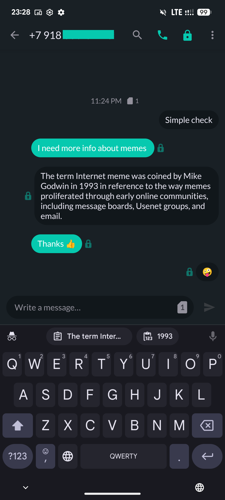
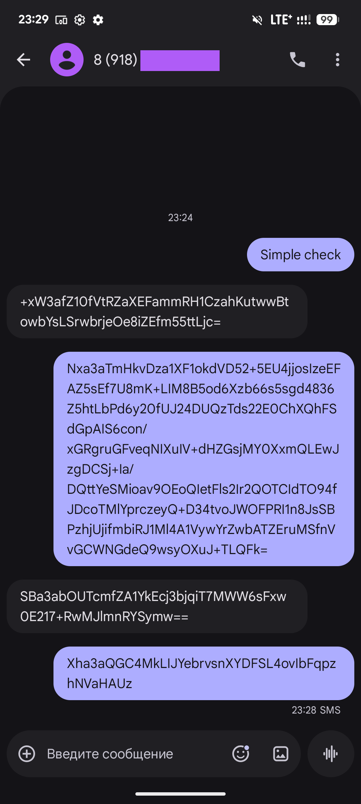

<p align="center">
  
</p>

<h1 align="center">Lapka SMS</h1>

<p align="center">
  <b>SMS-мессенджер с шифрованием для Android</b><br>
  Шифрование SMS через стеганографию — ваши сообщения выглядят как обычный текст
</p>

<p align="center">
  <a href="https://github.com/GeorgiyDemo/Lapka-SMS/actions"></a>
  <a href="https://github.com/GeorgiyDemo/Lapka-SMS/releases"></a>
  <a href="LICENSE"></a>
  
</p>

<p align="center">
  <a href="README.md">English version</a> · <a href="PROTOCOL_RU.md">Протокол</a>
</p>

---

## Что это?

Lapka SMS — полноценное SMS-приложение со встроенным шифрованием сообщений. Зашифрованные сообщения кодируются с помощью стеганографии — для перехватчика они выглядят как обычный текст на английском или русском языке. Основной противник — **мобильный оператор**, который может читать содержимое SMS при передаче.

> **Обоим собеседникам нужна Lapka SMS** с одинаковым ключом шифрования для обмена зашифрованными сообщениями. Обычные SMS работают с любым телефоном.

## Возможности

### Шифрование ([подробности протокола](PROTOCOL_RU.md))
- **AES-256-GCM** — аутентифицированное шифрование с выводом ключей через HKDF-SHA256
- **Защита от replay-атак** — отклонение старых и повторно отправленных сообщений
- **Скрытие длины сообщения** — padding предотвращает анализ трафика

### Схемы стеганографии
| Схема | Пример вывода | Подходит для |
|---|---|---|
| Base64 | `dGVzdA==` | Универсальная, компактная |
| Кириллический Base64 | `дГВздА==` | Сливается с кириллическим текстом |
| Русские слова | `молоко дерево книга` | Выглядит как русский текст |
| Английские слова | `Drawcut Foussa Miranda` | Выглядит как английский текст |

### Управление ключами
- **Ключи для каждого диалога** — отдельный ключ для каждого контакта
- **Глобальный ключ** — запасной ключ для всех диалогов
- **Обмен через QR-код** — сканирование для передачи ключа
- **SHA-256 отпечаток** — проверка подлинности ключа
- **Android Keystore** — аппаратное хранение ключей
- **EncryptedSharedPreferences** — ключи зашифрованы в хранилище

### Приватность и безопасность
- **FLAG_SECURE** — скрытие содержимого приложения в диспетчере задач (настраивается)
- **Автоудаление зашифрованных сообщений** — настраиваемый таймер
- **SMS для сброса** — получение заданной SMS стирает все ключи шифрования и сбрасывает настройки шифрования. Сообщения остаются, но становятся нечитаемыми
- **Без аналитики и отслеживания**
- **Зашифрованная база данных Realm**

### SMS-приложение
- Material Design с настраиваемыми темами
- Ночной режим (авто/ручной/системный)
- Настройки уведомлений для каждого диалога
- Отложенная отправка
- Отчёты о доставке
- Поддержка двух SIM-карт
- Свайп-действия
- 38 языков

## Модель угроз

| Защищено | Не защищено |
|---|---|
| Содержимое сообщений (AES-256-GCM) | Метаданные коммуникации (кто, когда, как часто) |
| Длина сообщения (padding) | Факт использования Lapka SMS обеими сторонами |
| Ключи в хранилище (Keystore + EncryptedSharedPreferences) | Физический доступ к разблокированному устройству |
| Содержимое приложения в диспетчере задач (FLAG_SECURE) | Безопасность устройства получателя |

## Быстрый старт

### 1. Установка

Скачайте последний APK из [Releases](https://github.com/GeorgiyDemo/Lapka-SMS/releases) и установите. Установите как SMS-приложение по умолчанию при запросе.

> **Google Play Защита может заблокировать установку**, потому что приложение не распространяется через Google Play. Это ложное срабатывание — приложение с открытым исходным кодом и не содержит вредоносного ПО. Для установки:
>
> 1. Если вы видите **«Приложение заблокировано для защиты устройства»** — нужно временно отключить Play Защиту:
>    - Откройте **Google Play** → нажмите на **иконку профиля** → **Play Защита** → **Настройки** (шестерёнка) → отключите **«Сканирование приложений с помощью Play Защиты»**
>    - Установите APK
>    - Включите Play Защиту обратно после установки
> 2. Если после установки вы видите **«Запрос на использование в качестве приложения по умолчанию (SMS) отклонён»** — Android 13+ ограничивает права приложений, установленных не из магазина. Для исправления:
>    - Перейдите в **Настройки Android** → **Приложения** → найдите **Lapka SMS** → нажмите **⋮** (три точки, правый верхний угол) → **«Разрешить ограниченные настройки»**
>    - Теперь откройте Lapka SMS и примите запрос на назначение SMS-приложением по умолчанию

### 2. Настройка шифрования

Откройте диалог → нажмите **⋮** меню → **Детали** → **Ключ шифрования**.

1. Включите переключатель **Ключ шифрования**
2. Нажмите **Сгенерировать новый ключ** — будет создан случайный AES-256 ключ
3. Передайте ключ собеседнику через **QR-код** (при встрече) или скопируйте через защищённый канал. **Никогда не отправляйте ключ обычным SMS!**
4. Убедитесь, что **эмодзи-отпечаток** совпадает на обоих устройствах
5. Прокрутите вниз и выберите **схему кодирования**

<p float="left">
  
  
</p>

Доступные схемы кодирования:

| Схема | Выглядит как |
|---|---|
| Base64 | `dGVzdA==` — случайные символы |
| Кириллический Base64 | `дГВздА==` — кириллические символы |
| Русские слова | `молоко дерево книга` — русский текст |
| Английские слова | `Drawcut Foussa Miranda` — английский текст |

### 3. Отправка зашифрованных сообщений

**Иконка замка** 🔒 рядом с каждым сообщением показывает что шифрование активно. Просто пишите и отправляйте — сообщения шифруются автоматически. Входящие зашифрованные сообщения расшифровываются прозрачно.

<p float="left">
  
  
</p>

*Слева: Lapka SMS (расшифрованный вид) · Справа: как это выглядит в обычном SMS-приложении*

## Сборка из исходников

Требуется **JDK 17**.

```bash
git clone https://github.com/GeorgiyDemo/Lapka-SMS.git
cd Lapka-SMS
./gradlew assembleDebug
```

## Архитектура

```
presentation/   UI-слой Android (Activities, Conductor Controllers, ViewModels)
domain/          Бизнес-логика, интеракторы, модели
data/            Репозитории, ресиверы, Realm
common/          Общие утилиты
psms-lib/        Библиотека шифрования (AES-GCM, HKDF, стеганография)
android-smsmms/  Легаси MMS/SMS фреймворк
```

Основные паттерны:
- **Conductor** — навигация (Controllers внутри Activities)
- **Dagger 2** — внедрение зависимостей
- **RxJava 2** + AutoDispose — реактивные потоки
- **Realm** — зашифрованное хранилище данных

## Отличия от upstream

Lapka SMS — форк [Partisan-SMS](https://github.com/wrwrabbit/Partisan-SMS) (который сам форк [QKSMS](https://github.com/moezbhatti/qksms)). Изменения в Lapka SMS:

- Обновлённый протокол шифрования v3 с новыми стеганографическими кодировщиками
- Обновлённые зависимости (Dagger 2.52, Glide 4.16, Kotlin 1.9, compileSdk 35)
- Шифрование базы данных (Realm encryption через Android Keystore)
- EncryptedSharedPreferences для хранения ключей
- Верификация ключей по отпечатку
- Выбор языка внутри приложения
- Усиление безопасности (network security config, приватное логирование, FLAG_SECURE)
- CI/CD пайплайн
- Модернизация кодовой базы (обновление устаревших API, миграция на AndroidX)

## Лицензия

[GNU General Public License v3.0](LICENSE)
