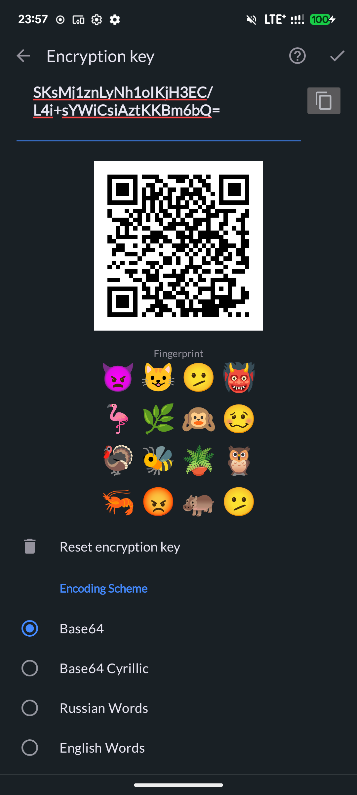

<p align="center">
  
</p>

<h1 align="center">Lapka SMS</h1>

<p align="center">
  <b>适用于 Android 的加密短信应用</b><br>
  通过隐写术加密短信 — 您的消息看起来就像普通文本
</p>

<p align="center">
  <a href="https://github.com/GeorgiyDemo/Lapka-SMS/actions"></a>
  <a href="https://github.com/GeorgiyDemo/Lapka-SMS/releases"></a>
  <a href="LICENSE"></a>
  
</p>

<p align="center">
  <a href="README.md">English version</a> · <a href="README_RU.md">Русская версия</a> · <a href="PROTOCOL_ZH.md">协议</a>
</p>

---

## 这是什么？

Lapka SMS 是一款功能完善的短信应用，内置消息加密功能。加密消息通过隐写术编码 — 对任何拦截者来说，它们看起来就像英文或俄文文本。主要防范对象是能够在传输过程中读取短信内容的**移动运营商**。

> **双方都需要安装 Lapka SMS** 并使用相同的加密密钥才能交换加密消息。未加密的短信可以与任何手机正常收发。

## 功能特性

### 加密（[协议详情](PROTOCOL.md)）
- **AES-256-GCM** 认证加密，采用 HKDF-SHA256 密钥派生
- **重放保护** — 拒绝旧消息和重放消息
- **消息长度隐藏** — 填充机制防止流量分析

### 隐写术方案
| 方案 | 输出示例 | 适用场景 |
|---|---|---|
| Base64 | `dGVzdA==` | 通用，紧凑 |
| Cyrillic Base64 | `дГВздА==` | 与西里尔文本混合 |
| Russian Words | `молоко дерево книга` | 看起来像俄文文本 |
| English Words | `Drawcut Foussa Miranda` | 看起来像英文文本 |

### 密钥管理
- **按会话独立密钥** — 每个联系人使用不同的密钥
- **二维码分享** — 扫描即可交换密钥
- **SHA-256 指纹** — 验证密钥真实性
- **Android Keystore** — 硬件支持的密钥存储
- **EncryptedSharedPreferences** — 密钥静态加密存储

### 隐私与安全
- **FLAG_SECURE** — 在任务切换器中隐藏应用内容（可配置）
- **自动删除加密消息** — 可配置定时器
- **重置短信** — 接收预定义的短信即可擦除所有加密密钥并重置加密设置。消息保留，但将无法解密
- **无分析，无追踪**
- **加密 Realm 数据库**

### 短信应用
- Material Design 界面，支持自定义主题
- 夜间模式（自动/手动/跟随系统）
- 按会话设置通知
- 延迟发送
- 送达报告
- 双 SIM 卡支持
- 滑动操作
- 38 种语言

## 威胁模型

| 已防护 | 未防护 |
|---|---|
| 消息内容（AES-256-GCM） | 通信元数据（谁、何时、多频繁） |
| 消息长度（填充） | 双方均使用 Lapka SMS 的事实 |
| 静态密钥材料（Keystore + EncryptedSharedPreferences） | 对已解锁设备的物理访问 |
| 任务切换器中的应用内容（FLAG_SECURE） | 接收方的设备安全性 |

## 快速上手

### 1. 安装

从 [Releases](https://github.com/GeorgiyDemo/Lapka-SMS/releases) 下载最新 APK 并安装。在提示时设置为默认短信应用。

> **Google Play Protect 可能会阻止安装**，因为该应用不通过 Google Play 分发。这是误报 — 该应用是开源的，不包含恶意软件。安装方法：
>
> 1. 如果您看到 **"App blocked for your protection"（应用已被阻止以保护您）** — 您需要临时禁用 Play Protect：
>    - 打开 **Google Play** → 点击您的 **头像** → **Play Protect** → **设置**（齿轮图标） → 关闭 **"使用 Play Protect 扫描应用"**
>    - 安装 APK
>    - 安装完成后重新启用 Play Protect
> 2. 如果安装后看到 **"Default SMS app request denied"（默认短信应用请求被拒绝）** — Android 13+ 限制侧载应用成为默认短信处理程序。修复方法：
>    - 前往 **Android 设置** → **应用** → 找到 **Lapka SMS** → 点击 **⋮**（右上角三个点） → **"允许受限设置"**
>    - 现在打开 Lapka SMS 并接受默认短信应用提示

### 2. 设置加密

打开一个会话 → 点击 **⋮** 菜单 → **详情** → **加密密钥**。

1. 启用 **加密密钥** 开关
2. 点击 **生成新密钥** — 将创建一个随机 AES-256 密钥
3. 通过 **二维码**（当面扫描）或通过安全渠道复制，将密钥分享给您的联系人。**切勿通过普通短信发送密钥！**
4. 验证两台设备上的 **emoji 指纹** 是否匹配
5. 向下滚动并选择一种 **编码方案**



可用的编码方案：

| 方案 | 看起来像 |
|---|---|
| Base64 | `dGVzdA==` — 随机字符 |
| Cyrillic Base64 | `дГВздА==` — 西里尔随机字符 |
| Russian Words | `молоко дерево книга` — 俄文文本 |
| English Words | `Drawcut Foussa Miranda` — 英文文本 |

### 3. 发送加密消息

每条消息旁边的 **锁图标** 🔒 表示加密已激活。只需输入并发送 — 消息将自动加密。收到的加密消息将透明解密。

<p float="left">
  
  
</p>

*左：Lapka SMS（解密视图） · 右：在普通短信应用中的显示效果*

## 从源码构建

需要 **JDK 17**。

```bash
git clone https://github.com/GeorgiyDemo/Lapka-SMS.git
cd Lapka-SMS
./gradlew assembleDebug
```

## 架构

```
presentation/   Android UI 层（Activities、Conductor Controllers、ViewModels）
domain/          业务逻辑、交互器、模型
data/            仓库、接收器、Realm 持久化
common/          共享工具类
psms-lib/        加密库（AES-GCM、HKDF、隐写术编码器）
android-smsmms/  旧版 MMS/SMS 框架
```

关键设计模式：
- **Conductor** 用于导航（Activities 中的 Controllers）
- **Dagger 2** 用于依赖注入
- **RxJava 2** + AutoDispose 用于响应式流
- **Realm** 用于加密数据库存储

## 与上游的区别

Lapka SMS 是 [Partisan-SMS](https://github.com/wrwrabbit/Partisan-SMS)（本身是 [QKSMS](https://github.com/moezbhatti/qksms) 的分支）的分支。Lapka SMS 的更改：

- 升级加密协议至 v3，新增隐写术编码器
- 新增俄语单词词典（约 84K 个单词）用于 Russian Words 隐写术
- 新增 English Words 隐写术方案（约 150K 单词词典）
- 移除全局加密密钥 — 仅支持按会话密钥
- 升级至 128 位 GCM 认证标签
- 加密数据库存储（通过 Android Keystore 加密 Realm）
- 使用 EncryptedSharedPreferences 存储密钥材料
- 密钥指纹验证（SHA-256 emoji 指纹）
- 会话去重（修复同一号码的重复会话问题）
- 更改包命名空间：从 `com.moez.QKSMS` 改为 `org.lapka.sms`
- 新应用图标和快捷方式图标
- 应用内加密设置指南（密钥设置中的帮助按钮）
- 应用内语言选择器
- 禁用 R8 混淆以减少杀毒软件误报
- 修复文本隐写术方案的 tryDecode/isEncrypted
- 安全加固（网络安全配置、私有文件日志、FLAG_SECURE）
- 升级依赖（Dagger 2.52、Glide 4.16、Kotlin 1.9、compileSdk 35）
- CI/CD 流水线与自动化发布
- 代码现代化（弃用 API 清理、AndroidX 迁移）

## 许可证

[GNU 通用公共许可证 v3.0](LICENSE)
